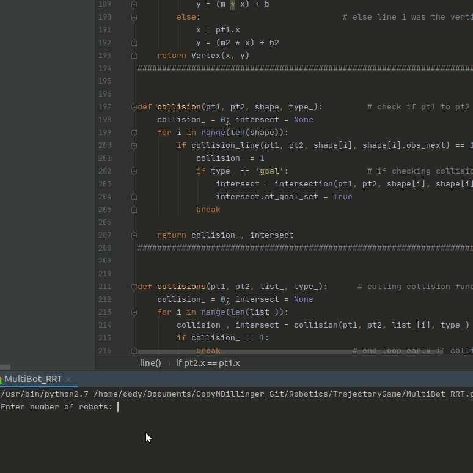

Multi-robot game-theoretic trajectory-based (open-loop) algorithm displayed through pygame

Theoretical Algorithm:
http://php.scripts.psu.edu/muz16/pdf/Zhu-Otte-ICRA14.pdf

Tested with Python 2.7.17, Ubuntu18

First step of this algorithm is essentially utilizing RRT methods, as displayed here:

